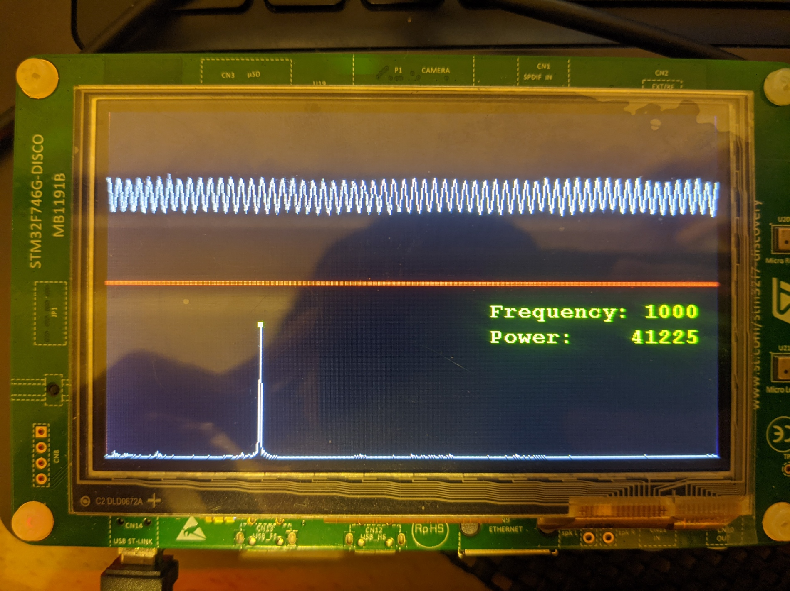
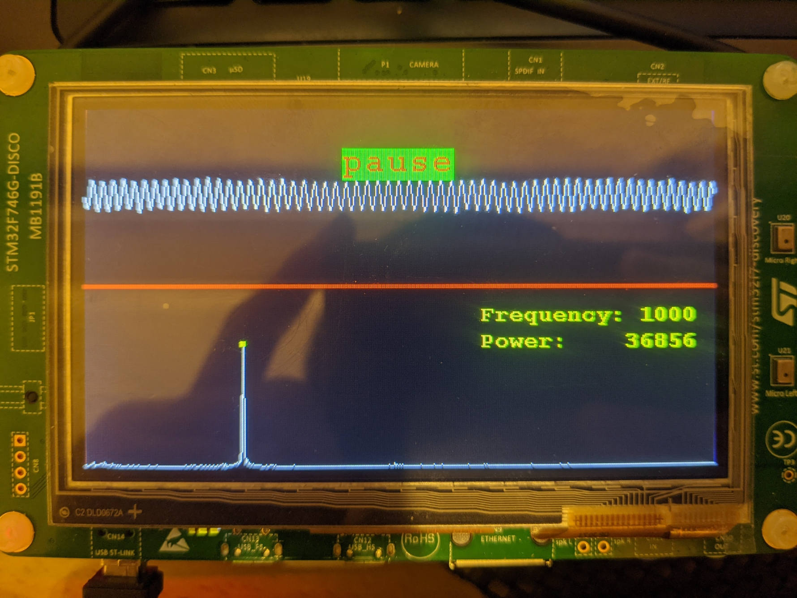

# Lab2 Microphone FFT Analyzer

* Display Microphone Signal at y-axis:0~130.
* Microphone sampling frequency 8kHz.
* Use FFT to transform signal and display at y-axis: 140-270.
* Display frequency range 0-4kHz.
* Touch Microphone signal will control start or stop recording.
* Touch FFT result with display the frequency and power.

## Recording

## Pause

